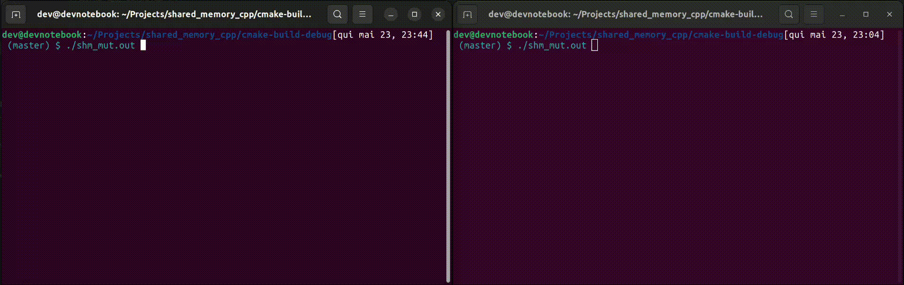

# Process sincronization using `Shared Memory` and `Boost` library in a `Linux` enviroment

## Requirements used on this project (earlier versions was not tested):
> - `Boost` Library;
> -  GNU GCC version 11 or later;
> - `CMake` version 3.22 or later;
> - `Ubuntu` version 22.04.4 LTS.

## Progress of this project:

### Today:
> Until now (May 23, 2024) is implemented an executable named `shm_mut.out` 
> which increments an integer variable to each period of 2000ms for 15 times.
> The period between the increments allows the user to observe the 
> sincronization once the result ouput is pointed to the default output 
> screen.

### Next step:
> Content in progress...

### Demonstration:
> The demonstration below shows two terminals, each one is running the program.
> Since the program properly sincronize the region critical it's suppose that
> each terminal never shows the same number.

